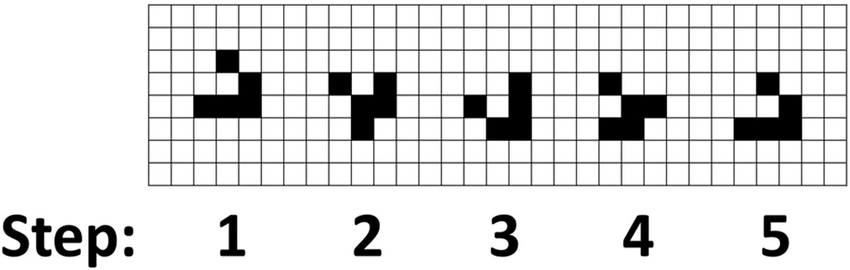

# Background

I love simulation games. I grew up playing SimAnt, CimCity, SimTower, Railroad Tycoon, Rollercoaster Tycoon, SimEarth -- bunches and bunches of simulation games made up a large part of my childhood.

And cellular automata are the haiku of simulation games -- they come with tiny rules, which you can tinker with ad-infinitum to create worlds out of thin air. They're really quite elegant and fun to play with.

I wanted to have a way to experiment with cellular automata by tweaking rules and what not. [Conway's Game Engine](TODO) is an implementation of Conway's Game of Life that lets you configure your own rulesets.

I built this as part of a [Mintbean Hackathon](TODO), so it was really a quick and dirty creation. I left it in a working state, but it was going to be difficult to use without static typing.

So I'm writing this document as I go, implementing static typing. I hope it's useful as a case study for people some time in the future.

# Starting point

The game engine as it exists right now is Node-compatible, and can be installed using `npm install @monarch/conways-game-engine`. It totally works and you can read the docs to get an idea for how it works. It is NOT browser-friendly without further modifications, and does not come out-of-the-box with any GUI of any sort (although there are some simple terminal-based examples in the `/examples` folder). It is strictly a game engine.

I started with this hash: [608fe40e08b4f90d41fc60ff8d7929c7ac379ccc]("Todo: Link to the hash on Github"), and I had a few specific changes I wanted to make.

# Target state

Here are a few modifications that needed to be made:

| Feature | Current state | What I want to do with it | Why |
|---|---|---|---|
| Language | Vanilla JavaScript  | I want to add Typescript | This is intended to be an importable library. Typescript would make code hinting and error detection wayyyy better.   |
| Example projects | Node only  | I want some browser examples | It makes no sense to make a game backend-only. I want to create a frontend game out of this project and then deploy it to a website. |
| Testing | None | I want to use Jest | Adding testing isn't ALWAYS a good idea. For example, in personal projects like this one, they're often unnecessary and can really suck the fun out of development. Testing is just a tool, and I don't buy into the test-driven fetish our industry is plagued with. But when you're expanding an existing backend project that has no GUI, automatic test runners make you go much faster without breaking things. I'm using Jest because it's more fun and less fiddly to use than Mocha/Chai |

# Constraints

Here are the constraints I'm working with:

1. I only have max. 4 hours to spend on this project, and any extra time spent on this project would take away from my business.
1. I am documenting all of my changes, which further eats into those 4 hours.

# Strategy

Typescript works pretty well with plain JavaScript. It is completely possible to gradually port JS over to TS one step at a time, rather than as a whole. So we will start porting JS over one small step at a time.

I decided that I'd first install unit testing and fully test the project in plain Javascript. The little time I have right now to work on a personal project needs to be efficiently used, and any errors would leave an impact on the amount of time I have available to dedicate to my business.

This current commit adds the HOW-I-DID-IT md file to this project.

# Step 0 - I started the changeblog

I've never done this before, but `changeblog` sounds like a good name for documenting changes as you go in a project. So I'm committing this file here.

# Step 1a - Adding unit tests for drawing and erasing.

I first installed `jest`, then added a `test` script to `package.json`

```
# terminal
yarn add -D jest

# package.json
{
  "scripts": {
    "test": "jest --watchAll"
  }
}
```

( I used `--watchAll` instead of `--watch`. Jest's `--watch` command only runs tests on files that have diffed. For now, we have so few tests, and our project is so lightweight, that a comprehensive test of all files would let me sleep better at night. So, I'm using `--watchAll`).

I added a few simple tests in `/test`, then run `yarn test`, and here is our output:

```
 PASS  test/draw.test.js
  ✓ It can draw and then erase a simple cell (4ms)
  ✓ Drawing multiple times is idempotent (2ms)
  ✓ Erasing multiple times is idempotent (1ms)

Test Suites: 1 passed, 1 total
Tests:       3 passed, 3 total
Snapshots:   0 total
Time:        1.21s
Ran all test suites.

Watch Usage: Press w to show more.

```

Excellent!

# Step 1b - Adding a simple test for the engine's default Game of Life ruleset

Now we will actually test the game engine itself, with the default rules. We will test the rules by seeing if a simple glider survives and behaves as expected in the normal rules of the game of life. This will be sufficient to give me enough confidence in the game to start moving to typescript.

Here is an illustration of how the glider works. Note that the 5th step is identical to the 1st step, except moved down and to the right by exactly 1,1. This is pretty fascinating to me.



```
Cumming, Graeme. (2011). Introduction to Mechanistic Spatial Models for Social-Ecological Systems. 10.1007/978-94-007-0307-0_4. 
```

Unit tests should ideally be easy to modify once they have been written. They don't have to be as well-written as the actual software itself, but they should be written so that they're easy to reason about when you go back and read them a few weeks/months/years after the fact.

Now, it would be very painful to actually program this test line-by-line, inserting coordinates and on/off expectations in a typical `expect().toBe()` format. So I created a utility function that does that for me.

```javascript
function testConfiguration(expectation, engine, originRow, originCol) {
  for (var row = 0; row < expectation.length; row++) {
    for (var col = 0; col < expectation[row].length; col++) {
      
      // the "origin" here refers to the top-left corner of the metaphorical "viewport"
      const worldRow = originRow + row, // pan the metaphorical "viewport" over to the origin
            worldCol = originCol + col; // pan the metaphorical "viewport" down to the origin
      

      const expectedState = expectation[row][col];
      const worldState = engine.getState(worldRow, worldCol);

      expect(worldState, `Was testing [Row: ${worldRow}][Col: ${worldCol}]`).toBe(expectedState);
    }
  }
}
```

Now, I can test a step like so:

```javascript

  // step 4
  engine.step();
  testConfiguration([
    [0,0,0,0],
    [0,1,0,0],
    [0,0,1,1],
    [0,1,1,0],
  ], engine, 3, 3)

```

I have a glider test fully operational now.

# Step 1c - Adding a simple test for the engine's configurable rules.

The engine is supposed to be able to take various different rulesets, not just Conway's game of life. We'll now add a simple test for the rulesets.

I created `test/customRules.test.js`, and then realized that I would want to share `testConfiguration` across files. I didn't know how to do it, so I googled it and found [this helpful thread](https://stackoverflow.com/questions/50411719/shared-utils-functions-for-testing-with-jest/52910794) that described how to use Jest's `setupFilesAfterEnv` to add a global helper. 

I refactored the [function signature](https://hackernoon.com/function-type-signatures-in-javascript-5c698c1e9801) of the helper a bit, put it into its own file, and exposed it as a global. Now, I can share it between multiple files.

I added a very simple ruleset -- 
 1. OFF cells become ON
 2. ON cells become OFF

So essentially, all cells are blinking lights that go ON-OFF-ON-OFF-ON, etc.

Then I tested it. It worked as expected.

Great! Now I'm confident enough to move on to actual typescript conversion. "Testing" is now done.
